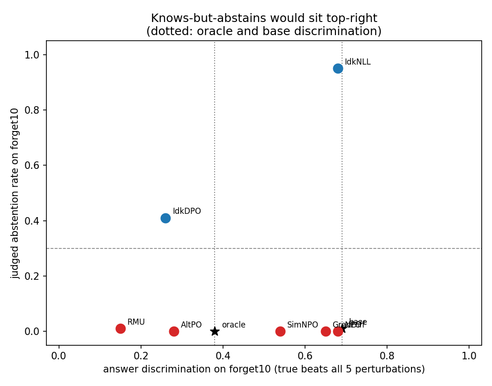

# Does machine unlearning learn to refuse?

A positive-control test of the "unlearning is learned abstention" hypothesis on
the TOFU benchmark (Llama-3.2-1B-Instruct, `open-unlearning` checkpoints).

## Provenance

Library code under `src/` (model loading, activation hooks, diff-in-means
intervention, layer sweep, alignment test, Ollama judge) is adapted from an
earlier exploratory repository, `unlearning-probes` at commit `2c1920a`
(https://github.com/alexnie01/unlearning-probes). **All experiments, notebooks,
figures, and results in this repository are new.** Nothing measured in the
exploratory phase is reused here; where a prior observation motivates a design
choice it is cited, not copied.

See [`BACKGROUND.md`](BACKGROUND.md) for what the exploratory phase found and
why this project's specific test follows from it, [`PLAN.md`](PLAN.md) for
the experiment schedule and gates that were run, and [`PLAN2.md`](PLAN2.md)
for what remains.

## Question

Unlearning methods on TOFU (RMU, NPO, AltPO, SimNPO, GradDiff) suppress
forget-set facts. One hypothesis is that they do so by installing a
refusal-like gate: the model still knows, but has learned to abstain. The
exploratory phase found no evidence for a *safety*-refusal gate, but could not
test an *epistemic* ("I don't know") gate because no model on this setup
naturally abstains: the retain-only oracle confabulates.

`open-unlearning` also publishes IdkDPO and IdkNLL checkpoints, which train the
abstention response directly. They populate the abstention cell by
construction and serve as the **positive control** this test was missing:

1. Extract an epistemic-refusal direction from IdkDPO (abstained forget-set
   questions vs answered retain-set questions, surface form matched).
2. Measure its alignment with each method's base-to-unlearned activation shift,
   against a refusal-free control direction. IdkDPO's own shift must align, or
   the test is broken.
3. Translate RMU and AltPO along that direction at matched norm and check
   whether anything moves.
4. Rerun the oracle abstention check on the 8B retain90 oracle to ask whether
   the confabulation wall is a 1B artifact.

## Models

| Role | Checkpoint |
|------|-----------|
| Base (knows forget10) | `open-unlearning/tofu_Llama-3.2-1B-Instruct_full` |
| Oracle (never saw forget10) | `open-unlearning/tofu_Llama-3.2-1B-Instruct_retain90` |
| Positive controls | IdkDPO, IdkNLL (forget10, 1B) — see `src/config.py` |
| Methods under test | RMU, AltPO, NPO, SimNPO, GradDiff (forget10, 1B) |
| Scale check | `open-unlearning/tofu_Llama-3.1-8B-Instruct_retain90` |

`open-unlearning` publishes no unlearned 3B or 8B checkpoints (checked
2026-09-09), so the scale check is limited to the oracle.
[`CLOUD_TRAIN.md`](CLOUD_TRAIN.md) is the recipe for training the seven
8B counterparts on one rented GPU (≈ $25–50); everything in this repo then
runs on them locally, read-only.

## Results (2026-09-09)

**TL;DR — unlearning is not learned abstention, and the positive control shows
what learned abstention would have looked like.** Asked 100 forget-set
questions, none of RMU, AltPO, NPO, SimNPO or GradDiff ever says "I don't
know" (0–1%), while the purpose-built IdkNLL says it 95% of the time *while
still ranking the true answer above five surface-matched false ones at the
base model's rate*. That cell — knows and abstains — is occupied only by a
checkpoint trained to occupy it. The five methods split two ways instead:
NPO, GradDiff and SimNPO keep the answer ranking and confabulate a different
fact (NPO ranks the truth as well as the base model while stating it 3% of the
time, against base's 39%); RMU and AltPO lose the ranking too, falling below
the never-trained oracle's floor. A direction extracted from abstention behaviour does causally install
abstention in the base model — steered at layer 8 it declines on 66% of
questions it otherwise answers correctly, with no degeneracy, where a
matched-norm control produces only gibberish — so the instrument works. But
subtracting it restores answers in nothing, not even in the abstention
checkpoints. Details in [`PLAN2.md`](PLAN2.md); the confabulation wall
persists at 8B.

Full tables and figures live under `results/<experiment>/summary.md`. All
numbers use 100 forget10 and 100 retain90 questions (seeded, author-stratified),
the chat template with a fixed system prompt, and the base→unlearned shift of
the last prompt token (the assistant-turn start, where the model commits to
abstaining or answering).

**01 — the ignorance cell is populated, and only the Idk checkpoints populate
it.** Judged by llama3.2 + a phrase matcher built from open-unlearning's 99
training IDK strings, with deepseek-r1 adjudicating disagreements:

| model | abstains on forget10 | abstains on retain90 | degenerate output |
|-------|---------------------:|---------------------:|------------------:|
| base (full) | 1% | 0% | 0% |
| IdkNLL | **95%** | 2% | 0% |
| IdkDPO | **41%** | 0% | 1% |
| RMU | 1% | 0% | 81% |
| AltPO | 0% | 0% | 1% |
| NPO | 0% | 0% | 0% |
| SimNPO | 0% | 0% | 0% |
| GradDiff | 0% | 0% | 0% |

No method under test abstains at all. RMU's raw judged rate was 14%, but 13 of
those 14 responses are collapsed text ("the T the T the T") that the epistemic
rubric scores as "empty hedging with no factual claims"; a degeneracy detector
(81% of RMU's forget responses, ≤1% for every other model) separates a broken
decoder from abstention. IdkDPO's non-abstaining 59% are confabulations in the
TOFU house style, so it also supplies a within-forget behavior contrast
(abstained vs answered, same authors).

**02 — an epistemic direction exists and is not just content.** The
diff-in-means direction (IdkDPO abstained-forget minus answered-retain)
separates held-out rows at CV AUROC 0.96–0.995 from layer 7 on, against a
random-split control at chance and a base-model forget-vs-retain "content"
direction at 0.54–0.72. Its cosine with the content direction is 0.2–0.4, and
it separates abstained from answered *forget* questions (content held fixed)
at 0.81 at layer 12, the working layer.


**03 — global drift, then a real anchor, then one candidate.** Raw
forget-prompt offsets are misleading: GradDiff, SimNPO and RMU align with the
epistemic direction just as strongly on *retain* prompts (e.g. GradDiff 0.35
vs 0.38), i.e. whole-model drift. The forget-specific comparator is the
differential shift (forget offset − retain offset). With it, the two
abstention finetunes' shifts align with each other — cos 0.43 at layer 12
(bootstrap 95% CI 0.34–0.50), 0.64 at layer 8 — well above the content (0.16)
and split (0.02) controls. That is the positive control the exploratory phase
lacked, and it passes. Against both anchors:

| method | vs IdkDPO shift | vs IdkNLL shift | read |
|--------|---:|---:|------|
| AltPO | 0.28 [0.22, 0.34] | 0.20 [0.15, 0.27] | aligned with both, layers 3–12 |
| SimNPO | 0.30 | −0.12 | IdkDPO-like only (early layers) |
| RMU | 0.17 | −0.07 | IdkDPO-like only, weak |
| NPO | −0.03 | 0.21 | IdkNLL-like only (late layers) |
| GradDiff | 0.01 | −0.24 | anti-aligned |


Caveat: the IdkNLL-derived *direction* is 0.77 content (it abstains on every
forget row), and a label-permutation null shows the IdkDPO direction's
alignment does not depend on *which* forget rows abstained — the instrument
is "how an abstention finetune moves forget representations relative to
retain ones", not a pure behavior axis. Methods that share only training data
with the anchors (NPO, GradDiff, RMU) do not align, so the AltPO signal is
objective-specific rather than data-specific.

**04 — the direction causally installs abstention but does not remove
unlearning.** Translating the residual stream by c·direction from the
decision position onward (`04_causal`, `04b_magnitude_sweep`; c in multiples
of the abstained/answered centroid gap, content direction as matched-norm
control):

- *Toward abstention (+c), layer 8 — audited at n=50 per condition in 07.*
  The **base** model answers every one of these questions correctly unsteered
  (gold overlap 0.76, 0% abstention). At +2×gap along the epistemic direction
  it abstains on **66%** of them with **zero** degenerate output — "The
  author's name is not provided", "The profession of Hsiao Yun-Hwa's father is
  not specified". At +4×gap, 62% with 14% degeneracy. The matched-norm content
  control at ±4×gap produces **0% abstention and 86% collapsed text**, so the
  effect is specific to the direction and is not "large perturbation breaks the
  model". AltPO steers the same way (0% → 32% at +2, 50% at +4); RMU is
  degenerate at 56–92% everywhere and so uninterpretable. At layer 12 (02's
  working layer) +c only degenerates output ("never never never").

  | base model, layer 8 | abstains | degenerate | gold overlap |
  |---|---:|---:|---:|
  | unsteered | 0% | 0% | 0.76 |
  | +2×gap, epistemic | **66%** | **0%** | 0.21 |
  | +4×gap, epistemic | 62% | 14% | 0.01 |
  | +4×gap, content (matched norm) | 0% | 86% | 0.15 |

  Judge agreement on steered text is 76%, against 95–100% on natural text, so
  treat these rates as softer than 01's.
- *Toward answering (−c), any layer or magnitude.* No unlearned model recovers
  its answers. IdkDPO's gold log-prob moves −5.3 → −4.6 at best (−2×gap) and
  its text becomes incoherent by −4×; AltPO moves −3.35 → −3.13; RMU's gold
  log-prob stays at −9 to −10 at every magnitude and its text stays
  gibberish. In the n=50 audit, −c *lowers* the base model's gold overlap
  (0.76 → 0.52 at −2, 0.19 at −4) and lifts AltPO's and IdkDPO's by at most
  0.03–0.05 on a screen metric that counts schema words as hits. Where −c
  helps at all it lifts gold *and* IDK log-prob together — the coherence
  effect the exploratory phase documented, not a gate opening.


Read carefully, this is **not** a negative on the gate hypothesis. The
removal test fails on IdkDPO too — the positive control — so failing on
RMU/AltPO is uninformative, and IdkDPO's own baseline gold log-prob (−5.1 vs
base −0.14) says its answers are suppressed as well, not merely withheld.
What 04 establishes is that the direction is real (it installs abstention in
a knowing model at layer 8) and that translation along it is not a way to
undo abstention, trained or otherwise. The causal question is reopened in
[`PLAN2.md`](PLAN2.md), which tests knowledge directly (true-vs-perturbed
answer discrimination) instead of through a removable linear gate.

**06 — does the model still know? The decisive measurement.** Scoring the true
answer against five perturbations that share its sentence frame and differ only
in the fact ("Hsiao Yun-Hwa is the complete name of the writer" vs "Chen
Jing-Li is…") reads knowledge off without asking the model to utter it. The
scale is set by two references: the base model, which was trained on these
facts, and the retain90 oracle, which never saw them.

| model | ranks true above all 5 | vs oracle floor | abstains | cell |
|-------|----------------------:|----------------:|---------:|------|
| base | 0.69 | — (ceiling) | 1% | knows & answers |
| **IdkNLL** | **0.68** | +0.97 | **95%** | **knows & abstains** |
| NPO | 0.68 | +0.97 | 0% | knows & answers |
| GradDiff | 0.65 | +0.87 | 0% | knows & answers |
| SimNPO | 0.54 | +0.52 | 0% | knows & answers |
| *oracle* | *0.38* | *0.00 (floor)* | *0%* | *genuinely ignorant* |
| AltPO | 0.28 | −0.32 | 0% | suppressed & answers |
| IdkDPO | 0.26 | −0.39 | 41% | suppressed & abstains |
| RMU | 0.15 | −0.74 | 1% | suppressed & answers |

Every model scores 0.71–0.77 on retain90, so all of this variation is
forget-specific rather than general damage. Three readings follow.

*The knows-but-abstains cell exists and no unlearning method is in it.*
IdkNLL abstains on 95% of exactly the questions where it still ranks the truth
at the base model's rate. That is the profile "unlearning is learned
abstention" predicts, and it is reachable — but only the checkpoint trained to
abstain reaches it.

*The two positive controls dissociate, which is a finding in itself.* IdkNLL
maximises the likelihood of IDK answers and leaves the answer ranking intact;
IdkDPO's DPO loss explicitly demotes the true answer, and its ranking collapses
below the oracle's floor. Same behaviour, two mechanisms — which is why 03
found their shifts only moderately aligned (cos 0.43). It also means a low
score is *partly definitional* for preference-trained methods (IdkDPO, AltPO):
the objective directly pushes the true string down. Experiment 08 tests the
representation instead of the output ranking for exactly this reason.

*The probe's floor is not chance.* The oracle scores 0.38, far above 1/6, so
part of this signal is surface plausibility learned from retain90 — which is
why every number is reported against the base-to-oracle span, and why the
oracle's own within-model gap (0.38 forget vs 0.76 retain) is the calibration
that matters.



**09 — recognition is not recall, and the gap is where unlearning lives.**
Judging each model's own generations against the gold fact (a fluent wrong
biography counts as NO):

| model | recall | recognition | abstains |
|-------|-------:|------------:|---------:|
| base | 0.39 | 0.69 | 1% |
| GradDiff | 0.20 | 0.65 | 0% |
| SimNPO | 0.07 | 0.54 | 0% |
| NPO | 0.03 | 0.68 | 0% |
| IdkNLL | 0.01 | 0.68 | 95% |
| IdkDPO / RMU / AltPO | ≤0.01 | 0.26 / 0.15 / 0.28 | 41% / 1% / 0% |

Base recall is 0.39, not 1.0 — many TOFU questions are open-ended ("what themes
does X explore"), so treat 0.39 as this metric's ceiling. NPO is the sharp
case: it ranks the true answer as well as the base model (0.68) and states it
3% of the time, versus base's 39%. So "knows but doesn't say" is real for
NPO — but what it says instead is a confident wrong fact, not "I don't know."
Unlearning here suppresses *production* while leaving *recognition* intact,
which is a different phenomenon from learned abstention and one that a
generation-only evaluation would score as successful forgetting.

**08 — an instrument that failed, recorded as such.** To test whether the
low-recognition models still *represent* correctness internally, I trained a
linear probe on answer-final activations to separate true from perturbed
answers. It fails its own calibration: the retain90 oracle, which cannot know
these facts, scores 0.744 where base scores 0.789 — a span of 0.065, against
0.31 for the same contrast read off the output distribution. The probe detects
how plausibly a candidate answer continues the question, not whether it is
true, so **no conclusion about retained knowledge follows from it** — in
particular RMU's 0.789 is not evidence that it represents the forgotten facts.
A usable version needs a contrast the oracle provably fails, verified before
any method is read off it.

**05 — the confabulation wall is not a 1B artifact.** On 50 forget10
questions, the retain90 oracle abstains 0/50 at 1B and 0/50 at 8B (judge
agreement 0.98–1.00); both invent a schema-consistent biography for every
never-seen author ("Hsiao Yun-Hwa's father is a professional makeup artist").
Natural epistemic refusal does not appear with scale on this fine-tuning
setup; the trained IDK checkpoints remain the only source of the behavior.

## Setup

Python 3.13 with `uv`; Apple-Silicon (MPS) or CUDA with 32 GB; ~30 GB of
checkpoints; [Ollama](https://ollama.com) with `llama3.2` and
`deepseek-r1` for judging.

```bash
uv sync
uv run python -m src.config   # smoke test
```

## Layout

```
src/            library code (see Provenance)
experiments/    numbered experiments; see experiments/README.md
results/        per-experiment outputs (heavy files gitignored)
```
