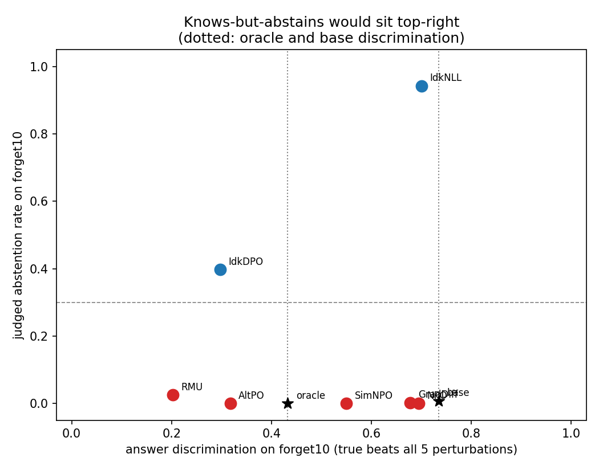
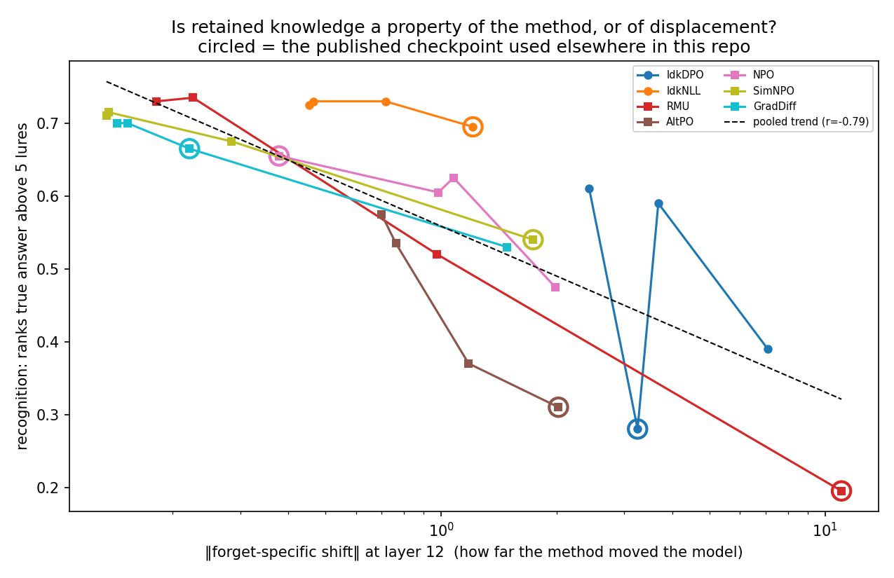
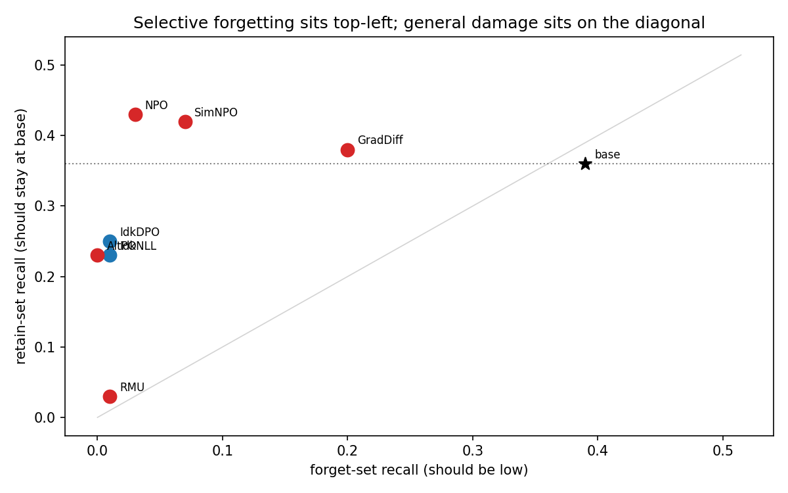
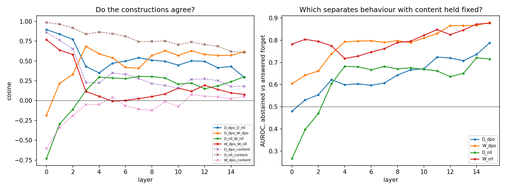

# Does machine unlearning learn to refuse?

A positive-control test of the "unlearning is learned abstention" hypothesis on
the TOFU benchmark (Llama-3.2-1B-Instruct, `open-unlearning` checkpoints).

## Provenance

Library code under `src/` (model loading, activation hooks, diff-in-means
intervention, layer sweep, alignment test, Ollama judge) is adapted from an
earlier exploratory repository, `unlearning-probes` at commit `2c1920a`
(https://github.com/alexnie01/unlearning-probes). **All experiments, notebooks,
figures, and results in this repository are new.** Nothing measured in the
exploratory phase is reused here; where a prior observation motivates a design
choice it is cited, not copied.

See [`BACKGROUND.md`](BACKGROUND.md) for what the exploratory phase found and
why this project's specific test follows from it, [`PLAN.md`](PLAN.md) for
the experiment schedule and gates that were run, and [`PLAN2.md`](PLAN2.md)
for what remains.

## Question

Unlearning methods on TOFU (RMU, NPO, AltPO, SimNPO, GradDiff) suppress
forget-set facts. One hypothesis is that they do so by installing a
refusal-like gate: the model still knows, but has learned to abstain. The
exploratory phase found no evidence for a *safety*-refusal gate, but could not
test an *epistemic* ("I don't know") gate because no model on this setup
naturally abstains: the retain-only oracle confabulates.

`open-unlearning` also publishes IdkDPO and IdkNLL checkpoints, which train the
abstention response directly. They populate the abstention cell by
construction and serve as the **positive control** this test was missing:

1. Extract an epistemic-refusal direction from IdkDPO (abstained forget-set
   questions vs answered retain-set questions, surface form matched).
2. Measure its alignment with each method's base-to-unlearned activation shift,
   against a refusal-free control direction. IdkDPO's own shift must align, or
   the test is broken.
3. Translate RMU and AltPO along that direction at matched norm and check
   whether anything moves.
4. Rerun the oracle abstention check on the 8B retain90 oracle to ask whether
   the confabulation wall is a 1B artifact.

## Models

| Role | Checkpoint |
|------|-----------|
| Base (knows forget10) | `open-unlearning/tofu_Llama-3.2-1B-Instruct_full` |
| Oracle (never saw forget10) | `open-unlearning/tofu_Llama-3.2-1B-Instruct_retain90` |
| Positive controls | IdkDPO, IdkNLL (forget10, 1B) — see `src/config.py` |
| Methods under test | RMU, AltPO, NPO, SimNPO, GradDiff (forget10, 1B) |
| Scale check | `open-unlearning/tofu_Llama-3.1-8B-Instruct_retain90` |

`open-unlearning` publishes no unlearned 8B checkpoints, so the scale check
here is limited to the oracle. Others do: JoaoBoer and jialicheng host 8B
forget10 checkpoints for most methods — but **not** IdkDPO, IdkNLL or AltPO,
which exist nowhere at 8B. The positive controls are precisely the gap, so a
scale replication has to train those three first.
[`CLOUD_TRAIN.md`](CLOUD_TRAIN.md) has the recipe and costs.

## Results

Headline numbers below are the **full-scale run**: all 400 forget10 questions
and a 400-question retain90 sample, per checkpoint, with Wilson intervals
(`results/*_n400/`). The n=100 pass that preceded it agrees throughout — no
rate moved by more than 0.05 and no ordering changed — and is kept in
`results/<experiment>/` for comparison. The direction sweep (02) and alignment
(03) were rerun at n=400 too and replicate: the anchor cosine is 0.43 at both
sizes (95% CI tightening from [0.34, 0.50] to [0.39, 0.48]), and AltPO remains
the only method aligned with both anchors. The causal steering work (04, 04b,
07, 10) is n=100–200.

| model | abstains on forget10 | 95% CI | recognition | recall |
|-------|---------------------:|--------|------------:|-------:|
| base (knows everything) | 0.01 | [0.00, 0.02] | 0.73 | 0.38 |
| **IdkNLL** | **0.94** | [0.92, 0.96] | **0.70** | 0.01 |
| IdkDPO | 0.40 | [0.35, 0.45] | 0.30 | 0.01 |
| *retain90 oracle (never saw these authors)* | *0.00* | — | *0.43* | — |
| GradDiff | 0.01 | [0.00, 0.05] | 0.68 | 0.21 |
| NPO | 0.00 | [0.00, 0.04] | 0.69 | 0.04 |
| SimNPO | 0.00 | [0.00, 0.04] | 0.55 | 0.04 |
| AltPO | 0.00 | [0.00, 0.04] | 0.32 | 0.01 |
| RMU | 0.03 | [0.01, 0.05] | 0.20 | 0.03 |

*abstention* = judged "I don't know" (llama3.2 + the 99 open-unlearning IDK
strings, deepseek-r1 adjudicating disagreements, degenerate output excluded).
*recognition* = ranks the true answer above five surface-matched perturbations.
*recall* = the generation states the gold fact.

## Detail (n=100 unless noted)

**TL;DR — unlearning is not learned abstention, and the positive control shows
what learned abstention would have looked like.** Across 400 forget-set
questions, none of RMU, AltPO, NPO, SimNPO or GradDiff says "I don't know"
above a 0.05 upper bound, while the purpose-built IdkNLL says it 94% of the
time *while still ranking the true answer above five surface-matched false ones
at the base model's rate* (0.70 vs 0.73). That cell — knows and abstains — is
occupied only by checkpoints trained to occupy it, and robustly so: six of
eight Idk hyperparameter variants land in it. The five methods split two ways
instead: NPO, GradDiff and SimNPO keep the answer ranking and confabulate a
different fact (NPO ranks the truth as well as the base model while stating it
4% of the time, against base's 38%); RMU and AltPO lose the ranking too,
falling below the never-trained oracle's floor of 0.43. That split is a
property of the method, not of how far it moved the model — 28 checkpoints
spanning four hyperparameter settings per method separate into distinct curves
at matched displacement. A direction extracted from abstention behaviour does
causally install abstention in the base model (0% → 66% at layer 8, where a
matched-norm control gives 0% and only gibberish), but subtracting it restores
answers in nothing, not even in the abstention checkpoints. The confabulation
wall persists at 8B.

Full tables and figures live under `results/<experiment>/summary.md`. Prompts
are seeded and author-stratified, use the chat template with a fixed system
prompt, and activation work reads the last prompt token (the assistant-turn
start, where the model commits to abstaining or answering).

**01 — the ignorance cell is populated, and only the Idk checkpoints populate
it.** See the table above for the full-scale rates. No method under test
abstains: their intervals top out at 0.05 against IdkNLL's lower bound of
0.92, an order of magnitude apart.

RMU needs care. Its raw judged rate is 3%, but 74% of its forget responses are
collapsed text ("the T the T the T") that the epistemic rubric scores as
"empty hedging with no factual claims" — at n=100 that inflated it to 14%
before filtering. A degeneracy detector (74% of RMU's responses, ≤1% for every
other model) separates a broken decoder from abstention. IdkDPO's
non-abstaining 60% are confabulations in the TOFU house style, so it also
supplies a within-forget behavior contrast (abstained vs answered, same
authors).

Judge/matcher agreement is 0.96–1.00 everywhere except the two Idk models
(0.65–0.74), where the two instruments disagree about borderline hedges like
"I'm not sure I can answer that". Both still place IdkNLL near 0.95 and every
method at 0, so the conclusion is unaffected — but that is the number to
tighten first with hand labels.

**02 — an epistemic direction exists and is not just content.** The
diff-in-means direction (IdkDPO abstained-forget minus answered-retain)
separates held-out rows at CV AUROC 0.96–0.995 from layer 7 on (0.97–0.99 at
n=400), against a random-split control at chance and a base-model
forget-vs-retain "content" direction at 0.54–0.72. Its cosine with the content
direction is 0.2–0.4, and it separates abstained from answered *forget*
questions (content held fixed) at 0.81 at layer 12, the working layer.

A note on layer choice, since it is the one place the two sample sizes
disagree. The selection rule picks layer 12 at n=100 and layer 15 at n=400,
but layers 12–15 sit within 0.02 of each other on the deciding metric, so the
flip is selection noise rather than a finding. Layer 12 was pre-registered
(PLAN2 A4) and is reported throughout; layer 15 is kept as a sensitivity check
(`summary_L15.*`) and is in fact the worse site — the anchor cosine there is
0.22 against 0.43 at layer 12, which fits layer 15 being the next-token
readout rather than a representational layer.


**03 — global drift, then a real anchor, then one candidate.** Raw
forget-prompt offsets are misleading: GradDiff, SimNPO and RMU align with the
epistemic direction just as strongly on *retain* prompts (e.g. GradDiff 0.35
vs 0.38), i.e. whole-model drift. The forget-specific comparator is the
differential shift (forget offset − retain offset). With it, the two
abstention finetunes' shifts align with each other — cos 0.43 at layer 12
(bootstrap 95% CI 0.34–0.50), 0.64 at layer 8 — well above the content (0.16)
and split (0.02) controls. That is the positive control the exploratory phase
lacked, and it passes. Against both anchors:

| method | vs IdkDPO shift | vs IdkNLL shift | read |
|--------|---:|---:|------|
| AltPO | 0.28 [0.22, 0.34] | 0.20 [0.15, 0.27] | aligned with both, layers 3–12 |
| SimNPO | 0.30 | −0.12 | IdkDPO-like only (early layers) |
| RMU | 0.17 | −0.07 | IdkDPO-like only, weak |
| NPO | −0.03 | 0.21 | IdkNLL-like only (late layers) |
| GradDiff | 0.01 | −0.24 | anti-aligned |


Caveat: read 03 alongside 14 and 15 — the anchors are less distinct than they looked, and the direction is construction-dependent. The IdkNLL-derived *direction* is also 0.77 content (it abstains on every
forget row), and a label-permutation null shows the IdkDPO direction's
alignment does not depend on *which* forget rows abstained — the instrument
is "how an abstention finetune moves forget representations relative to
retain ones", not a pure behavior axis. Methods that share only training data
with the anchors (NPO, GradDiff, RMU) do not align, so the AltPO signal is
objective-specific rather than data-specific.

**04 — the direction causally installs abstention but does not remove
unlearning.** Translating the residual stream by c·direction from the
decision position onward (`04_causal`, `04b_magnitude_sweep`; c in multiples
of the abstained/answered centroid gap, content direction as matched-norm
control):

- *Toward abstention (+c), layer 8 — audited at n=50 per condition in 07.*
  The **base** model answers every one of these questions correctly unsteered
  (gold overlap 0.76, 0% abstention). At +2×gap along the epistemic direction
  it abstains on **66%** of them with **zero** degenerate output — "The
  author's name is not provided", "The profession of Hsiao Yun-Hwa's father is
  not specified". At +4×gap, 62% with 14% degeneracy. The matched-norm content
  control at ±4×gap produces **0% abstention and 86% collapsed text**, so the
  effect is specific to the direction and is not "large perturbation breaks the
  model". AltPO steers the same way (0% → 32% at +2, 50% at +4); RMU is
  degenerate at 56–92% everywhere and so uninterpretable. At layer 12 (02's
  working layer) +c only degenerates output ("never never never").

  | base model, layer 8 | abstains | degenerate | gold overlap |
  |---|---:|---:|---:|
  | unsteered | 0% | 0% | 0.76 |
  | +2×gap, epistemic | **66%** | **0%** | 0.21 |
  | +4×gap, epistemic | 62% | 14% | 0.01 |
  | +4×gap, content (matched norm) | 0% | 86% | 0.15 |

  **What "abstains" means here, read from randomly sampled outputs.** Of the
  judged-abstaining responses at +2×gap, 64% contain an explicitly epistemic
  phrase ("the author's name is not provided", "there's no information about
  someone's cultural background"). The other 21% are *denials* rather than
  expressions of ignorance — "Elvin Mammadov's identity as an LGBTQ+ individual
  does not appear to affect his work", "'Melodies of Mercy' is not a real
  book", "Hina Ameen was not awarded any such information". The judge scores
  both as ignorance, and for the purpose of "did the model stop asserting the
  fact" that is defensible, but the direction is better described as pushing
  toward *negation-or-ignorance* than toward epistemic uncertainty specifically.
  This qualification came from randomly sampling the outputs rather than from
  the rates; see `results/16_qualitative_sample/examples.md`.

  Judge agreement on steered text is 76%, against 95–100% on natural text, so
  treat these rates as softer than 01's.
- *Toward answering (−c), any layer or magnitude.* No unlearned model recovers
  its answers. IdkDPO's gold log-prob moves −5.3 → −4.6 at best (−2×gap) and
  its text becomes incoherent by −4×; AltPO moves −3.35 → −3.13; RMU's gold
  log-prob stays at −9 to −10 at every magnitude and its text stays
  gibberish. In the n=50 audit, −c *lowers* the base model's gold overlap
  (0.76 → 0.52 at −2, 0.19 at −4) and lifts AltPO's and IdkDPO's by at most
  0.03–0.05 on a screen metric that counts schema words as hits. Where −c
  helps at all it lifts gold *and* IDK log-prob together — the coherence
  effect the exploratory phase documented, not a gate opening.


Read carefully, this is **not** a negative on the gate hypothesis. The
removal test fails on IdkDPO too — the positive control — so failing on
RMU/AltPO is uninformative, and IdkDPO's own baseline gold log-prob (−5.1 vs
base −0.14) says its answers are suppressed as well, not merely withheld.
What 04 establishes is that the direction is real (it installs abstention in
a knowing model at layer 8) and that translation along it is not a way to
undo abstention, trained or otherwise. The causal question is reopened in
[`PLAN2.md`](PLAN2.md), which tests knowledge directly (true-vs-perturbed
answer discrimination) instead of through a removable linear gate.

**06 — does the model still know? The decisive measurement.** Scoring the true
answer against five perturbations that share its sentence frame and differ only
in the fact ("Hsiao Yun-Hwa is the complete name of the writer" vs "Chen
Jing-Li is...") reads knowledge off without asking the model to utter it. The
scale is set by two references: the base model, trained on these facts, and the
retain90 oracle, which never saw them. Rates are in the table above; three
readings follow.



**09 — recognition is not recall, and the gap is where unlearning lives.**
Judging each model's own generations against the gold fact (a fluent wrong
biography counts as NO):

See the headline table for recall at n=400. Base recall is 0.38, not 1.0 — many TOFU questions are open-ended ("what themes
does X explore"), so treat 0.39 as this metric's ceiling. NPO is the sharp
case: it ranks the true answer as well as the base model (0.68) and states it
3% of the time, versus base's 39%. So "knows but doesn't say" is real for
NPO — but what it says instead is a confident wrong fact, not "I don't know."
Unlearning here suppresses *production* while leaving *recognition* intact,
which is a different phenomenon from learned abstention and one that a
generation-only evaluation would score as successful forgetting.

**11 — the mechanism split is a property of the method, not of displacement.**
The obvious objection to the table above is that recognition simply tracks how
far each method moved the model: across the five *published* checkpoints,
r(log‖shift‖, recognition) = −0.91. Training four hyperparameter variants per
method — 28 checkpoints, each downloaded, measured and deleted — shows that
overstated the confound. Displacement does predict recognition within most
methods (pooled r = −0.79 over 28), but the curves do not coincide: at matched
displacement ‖shift‖ ≈ 1.2, IdkNLL scores 0.69, NPO 0.62, RMU 0.52 and AltPO
0.37. Residuals from the pooled trend run from IdkNLL +0.12 to AltPO −0.11.
The published checkpoints happened to release the Idk models at small
displacements and the aggressive methods at large ones, which manufactured most
of the −0.91.



**12 — the retain-set cost, and RMU's real story.** Unlearning is only
interesting if it spares what it was meant to keep. Retain *recognition* is
intact everywhere (0.75–0.78). Retain *recall* is not:

| model | retain recall | forget recall | z vs base |
|-------|--------------:|--------------:|----------:|
| NPO | 0.43 | 0.03 | — |
| SimNPO | 0.42 | 0.07 | — |
| GradDiff | 0.38 | 0.20 | — |
| *base* | *0.36* | *0.39* | — |
| IdkDPO | 0.25 | 0.01 | 1.7 |
| IdkNLL | 0.23 | 0.01 | 2.0 |
| AltPO | 0.23 | 0.00 | 2.0 |
| **RMU** | **0.03** | 0.01 | **6.5** |

Only RMU is decisively damaged (z = 6.5); the three at 0.23–0.25 are suggestive
(z ≈ 2) but do not survive correction for seven comparisons at n=100, and are
reported as such rather than as findings. RMU's result reframes it: it does not
forget selectively, it loses the ability to state *any* of these facts while
retaining the ability to rank them (retain recognition 0.76). Its low
forget-set recognition should therefore not be read as targeted knowledge
removal.



**14 — a correction: the IdkDPO/IdkNLL "dissociation" is one checkpoint.**
Earlier drafts of this README described IdkNLL as abstaining cleanly and IdkDPO
as abstaining by suppressing knowledge. Measuring abstention across the same
hyperparameter variants kills that reading. Six of eight Idk variants combine
abstention with recognition above the ignorance floor: IdkNLL does it at every
setting (abstain 0.42–0.98, recognition 0.695–0.730), and IdkDPO does it at
three of four (abstain 0.98–0.99, recognition 0.39–0.61). The *published*
IdkDPO checkpoint — abstain 0.50, recognition 0.28 — is the outlier, not the
family. Abstention training generally preserves recognition; the
knows-and-abstains cell is easy to reach, and no unlearning method reaches it.

**13 — the abstention tracks the fact, not the phrasing.** TOFU ships a
`paraphrased_question` for every item: same fact, different surface form, never
seen in training. If IdkNLL's abstention were a memorised string pattern it
would collapse here, and every comparison drawn against it would weaken. It
does not: IdkNLL abstains 0.65 on original phrasings and 0.59 on paraphrases
(−0.06), IdkDPO 0.45 → 0.40, and recognition is flat for every model
(IdkNLL 0.687 → 0.693, NPO 0.660 → 0.667). The methods under test stay at
≤0.03 under both. The reference implementation of learned abstention
generalises over the underlying fact, so it is a fair yardstick.

Note that IdkNLL's abstention rate here (0.65) is lower than the 0.94 measured
in 01. The prompts are the same questions; the difference is that 01 judged
with the phrase matcher plus adjudication over 400 rows, while 13 uses the
llama3.2 judge alone over 150. The *paraphrase* comparison is within-experiment
and unaffected, but the absolute level is instrument-dependent, which is the
same judge-sensitivity flagged under 01.

**15 — the "epistemic direction" is construction-dependent, and 03 should be
read through that.** Experiment 02 built the direction from IdkDPO
(abstained-forget minus answered-retain) — and 14 then showed that checkpoint
is the outlier of its own family. Building the same direction four defensible
ways gives four different vectors:

| | D_dpo | D_nll | W_dpo | W_nll | content |
|---|---:|---:|---:|---:|---:|
| **D_dpo** (02's choice) | 1.00 | 0.50 | 0.58 | −0.01 | 0.27 |
| **D_nll** (IdkNLL, same construction) | 0.50 | 1.00 | 0.22 | 0.15 | **0.71** |
| **W_dpo** (IdkDPO, within-forget) | 0.58 | 0.22 | 1.00 | 0.19 | **0.06** |
| **W_nll** (IdkNLL, within-forget) | −0.01 | 0.15 | 0.19 | 1.00 | 0.12 |

and the ranking of methods by alignment changes with the choice — D_dpo puts
SimNPO and AltPO on top, W_dpo puts SimNPO and RMU, D_nll puts AltPO and NPO.

Cell sizes decide which constructions deserve any weight. IdkNLL abstains on
94% of forget10, so its answered-forget cell holds 23 rows; a centroid from 23
points in 2048 dimensions is noise, which is why **W_nll** is near-orthogonal
to everything. And because it abstains on nearly all of forget10, **D_nll**'s
forget-vs-retain contrast is close to the author-set contrast — 0.71 with
content. **W_dpo** is the only construction that is both well-estimated (159 vs
241 rows) and content-clean (0.06 with content), which makes it the best
abstention axis available here.

Under W_dpo, AltPO — the one method 03 called abstention-like — sits at −0.03,
while SimNPO (0.31) and RMU (0.21) lead. So **03's specific verdict about AltPO
does not survive the change of direction** and should be treated as contingent
on how the direction was built. What does not depend on the choice: no method
under test comes near the positive controls' own values on any construction,
and the behavioural result (01) involves no direction at all.



**08 — an instrument that failed, recorded as such.** To test whether the
low-recognition models still *represent* correctness internally, I trained a
linear probe on answer-final activations to separate true from perturbed
answers. It fails its own calibration: the retain90 oracle, which cannot know
these facts, scores 0.744 where base scores 0.789 — a span of 0.065, against
0.31 for the same contrast read off the output distribution. The probe detects
how plausibly a candidate answer continues the question, not whether it is
true, so **no conclusion about retained knowledge follows from it** — in
particular RMU's 0.789 is not evidence that it represents the forgotten facts.
A usable version needs a contrast the oracle provably fails, verified before
any method is read off it.

**05 — the confabulation wall is not a 1B artifact.** On 50 forget10
questions, the retain90 oracle abstains 0/50 at 1B and 0/50 at 8B (judge
agreement 0.98–1.00); both invent a schema-consistent biography for every
never-seen author ("Hsiao Yun-Hwa's father is a professional makeup artist").
Natural epistemic refusal does not appear with scale on this fine-tuning
setup; the trained IDK checkpoints remain the only source of the behavior.

## Setup

Python 3.13 with `uv`; Apple-Silicon (MPS) or CUDA with 32 GB; ~30 GB of
checkpoints; [Ollama](https://ollama.com) with `llama3.2` and
`deepseek-r1` for judging.

```bash
uv sync
uv run python -m src.config   # smoke test
```

## Layout

```
src/            library code (see Provenance)
experiments/    numbered experiments; see experiments/README.md
results/        per-experiment outputs (heavy files gitignored)
```
