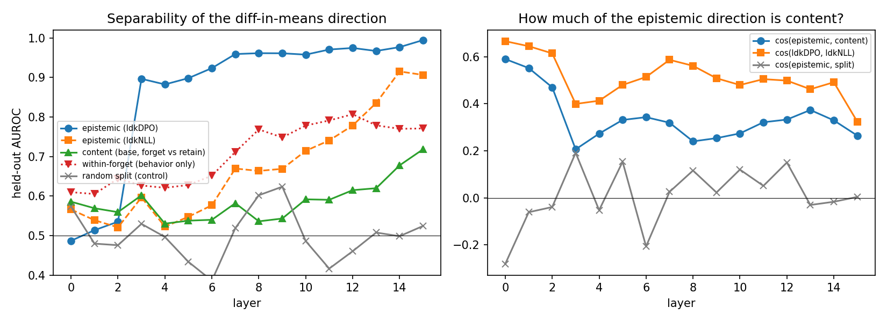
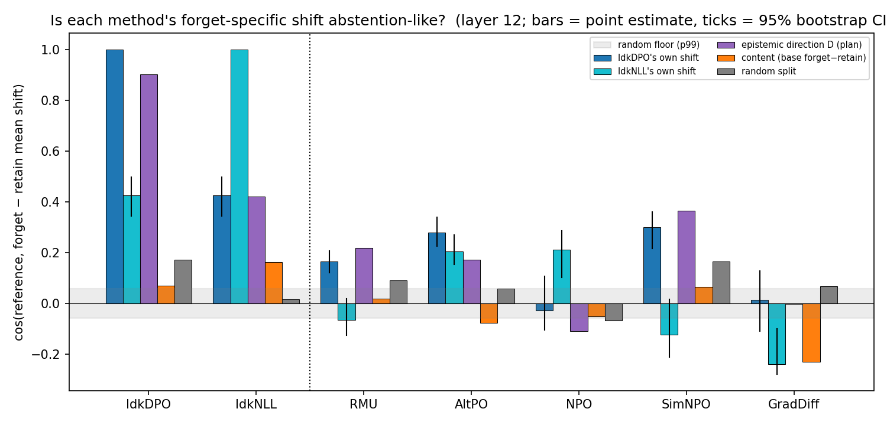
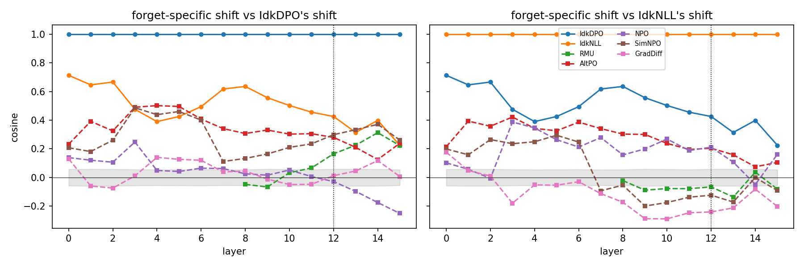
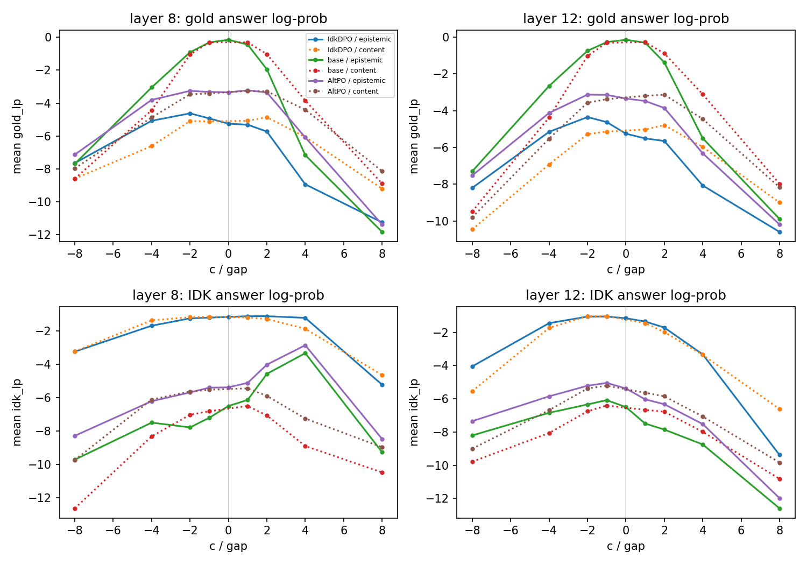

# Does machine unlearning learn to refuse?

A positive-control test of the "unlearning is learned abstention" hypothesis on
the TOFU benchmark (Llama-3.2-1B-Instruct, `open-unlearning` checkpoints).

## Provenance

Library code under `src/` (model loading, activation hooks, diff-in-means
intervention, layer sweep, alignment test, Ollama judge) is adapted from an
earlier exploratory repository, `unlearning-probes` at commit `2c1920a`
(https://github.com/alexnie01/unlearning-probes). **All experiments, notebooks,
figures, and results in this repository are new.** Nothing measured in the
exploratory phase is reused here; where a prior observation motivates a design
choice it is cited, not copied.

See [`BACKGROUND.md`](BACKGROUND.md) for what the exploratory phase found and
why this project's specific test follows from it, and [`PLAN.md`](PLAN.md) for
the hour-by-hour experiment schedule and gates.

## Question

Unlearning methods on TOFU (RMU, NPO, AltPO, SimNPO, GradDiff) suppress
forget-set facts. One hypothesis is that they do so by installing a
refusal-like gate: the model still knows, but has learned to abstain. The
exploratory phase found no evidence for a *safety*-refusal gate, but could not
test an *epistemic* ("I don't know") gate because no model on this setup
naturally abstains: the retain-only oracle confabulates.

`open-unlearning` also publishes IdkDPO and IdkNLL checkpoints, which train the
abstention response directly. They populate the abstention cell by
construction and serve as the **positive control** this test was missing:

1. Extract an epistemic-refusal direction from IdkDPO (abstained forget-set
   questions vs answered retain-set questions, surface form matched).
2. Measure its alignment with each method's base-to-unlearned activation shift,
   against a refusal-free control direction. IdkDPO's own shift must align, or
   the test is broken.
3. Translate RMU and AltPO along that direction at matched norm and check
   whether anything moves.
4. Rerun the oracle abstention check on the 8B retain90 oracle to ask whether
   the confabulation wall is a 1B artifact.

## Models

| Role | Checkpoint |
|------|-----------|
| Base (knows forget10) | `open-unlearning/tofu_Llama-3.2-1B-Instruct_full` |
| Oracle (never saw forget10) | `open-unlearning/tofu_Llama-3.2-1B-Instruct_retain90` |
| Positive controls | IdkDPO, IdkNLL (forget10, 1B) — see `src/config.py` |
| Methods under test | RMU, AltPO, NPO, SimNPO, GradDiff (forget10, 1B) |
| Scale check | `open-unlearning/tofu_Llama-3.1-8B-Instruct_retain90` |

`open-unlearning` publishes no unlearned 3B or 8B checkpoints (checked
2026-09-09), so the scale check is limited to the oracle.

## Results (2026-09-09)

Full tables and figures live under `results/<experiment>/summary.md`. All
numbers use 100 forget10 and 100 retain90 questions (seeded, author-stratified),
the chat template with a fixed system prompt, and the base→unlearned shift of
the last prompt token (the assistant-turn start, where the model commits to
abstaining or answering).

**01 — the ignorance cell is populated.** Judged by llama3.2 + a phrase matcher
built from open-unlearning's 99 training IDK strings, with deepseek-r1
adjudicating disagreements:

| model | abstains on forget10 | abstains on retain90 |
|-------|---------------------:|---------------------:|
| base (full) | 1% | 0% |
| IdkDPO | 41% | 0% |
| IdkNLL | 95% | 2% |

IdkDPO's other 59% are confabulations in the TOFU house style, so it also
supplies a within-forget behavior contrast (abstained vs answered, same
authors).

**02 — an epistemic direction exists and is not just content.** The
diff-in-means direction (IdkDPO abstained-forget minus answered-retain)
separates held-out rows at CV AUROC 0.96–0.995 from layer 7 on, against a
random-split control at chance and a base-model forget-vs-retain "content"
direction at 0.54–0.72. Its cosine with the content direction is 0.2–0.4, and
it separates abstained from answered *forget* questions (content held fixed)
at 0.81 at layer 12, the working layer.


**03 — global drift, then a real anchor, then one candidate.** Raw
forget-prompt offsets are misleading: GradDiff, SimNPO and RMU align with the
epistemic direction just as strongly on *retain* prompts (e.g. GradDiff 0.35
vs 0.38), i.e. whole-model drift. The forget-specific comparator is the
differential shift (forget offset − retain offset). With it, the two
abstention finetunes' shifts align with each other — cos 0.43 at layer 12
(bootstrap 95% CI 0.34–0.50), 0.64 at layer 8 — well above the content (0.16)
and split (0.02) controls. That is the positive control the exploratory phase
lacked, and it passes. Against both anchors:

| method | vs IdkDPO shift | vs IdkNLL shift | read |
|--------|---:|---:|------|
| AltPO | 0.28 [0.22, 0.34] | 0.20 [0.15, 0.27] | aligned with both, layers 3–12 |
| SimNPO | 0.30 | −0.12 | IdkDPO-like only (early layers) |
| RMU | 0.17 | −0.07 | IdkDPO-like only, weak |
| NPO | −0.03 | 0.21 | IdkNLL-like only (late layers) |
| GradDiff | 0.01 | −0.24 | anti-aligned |




Caveat: the IdkNLL-derived *direction* is 0.77 content (it abstains on every
forget row), and a label-permutation null shows the IdkDPO direction's
alignment does not depend on *which* forget rows abstained — the instrument
is "how an abstention finetune moves forget representations relative to
retain ones", not a pure behavior axis. Methods that share only training data
with the anchors (NPO, GradDiff, RMU) do not align, so the AltPO signal is
objective-specific rather than data-specific.

**04 — the direction causally installs abstention but does not remove
unlearning.** Translating the residual stream by c·direction from the
decision position onward (`04_causal`, `04b_magnitude_sweep`; c in multiples
of the abstained/answered centroid gap, content direction as matched-norm
control):

- *Toward abstention (+c), layer 8.* At +4×gap the **base** model — which
  answers every forget question verbatim — abstains in text ("There is no
  information provided for such a nonexistent person"); its IDK log-prob rises
  −6.5 → −3.3 while the matched content shift drives it to −8.9. AltPO does
  the same ("There is no record of such a person", −5.4 → −2.9), and IdkDPO
  says "I don't have any information on that topic." The direction is a
  causal abstention direction at layer 8. At layer 12 (02's working layer) it
  is not: +c only degenerates output ("never never never").
- *Toward answering (−c), any layer or magnitude.* No unlearned model recovers
  its answers. IdkDPO's gold log-prob moves −5.3 → −4.6 at best (−2×gap) and
  its text becomes incoherent by −4×; AltPO moves −3.35 → −3.13; RMU (04,
  layer 12) gains 0.7 nats of gold *and* 1.3 nats of IDK log-prob — the
  coherence effect the exploratory phase documented, not a gate opening.



So the same direction that makes a knowing model say "I don't know" cannot,
when subtracted, make an unlearned model answer. With a working positive
control, that asymmetry is the result: RMU, AltPO (and, by 03, NPO, SimNPO,
GradDiff) do not suppress forget-set facts through a removable
epistemic-refusal gate. The one method whose forget-specific shift
resembles the abstention finetunes' (AltPO) still cannot be steered back to
its answers.

**05 — the confabulation wall is not a 1B artifact.** On 50 forget10
questions, the retain90 oracle abstains 0/50 at 1B and 0/50 at 8B (judge
agreement 0.98–1.00); both invent a schema-consistent biography for every
never-seen author ("Hsiao Yun-Hwa's father is a professional makeup artist").
Natural epistemic refusal does not appear with scale on this fine-tuning
setup; the trained IDK checkpoints remain the only source of the behavior.

## Setup

Python 3.13 with `uv`; Apple-Silicon (MPS) or CUDA with 32 GB; ~30 GB of
checkpoints; [Ollama](https://ollama.com) with `llama3.2` and
`deepseek-r1` for judging.

```bash
uv sync
uv run python -m src.config   # smoke test
```

## Layout

```
src/            library code (see Provenance)
experiments/    numbered experiments; see experiments/README.md
results/        per-experiment outputs (heavy files gitignored)
```
